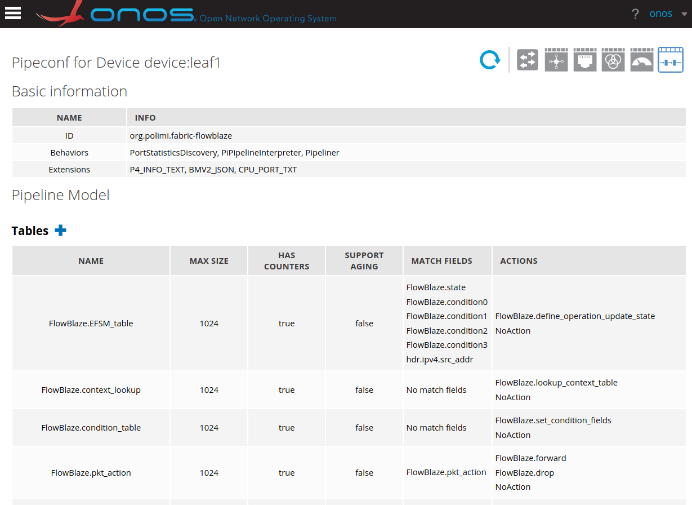

# ONOS FlowBlaze
Integration of [FlowBlaze.p4](https://github.com/ANTLab-polimi/flowblaze.p4) 
with the ONOS SDN controller.

The integration is composed of a modified `fabric.p4` program and a new ONOS
application providing a new pipeconf (`org.polimi.fabric-flowblaze`).

## Requirements
- `docker` and `docker-compose`
- `make`
- `python`
- `ssh` and `curl`

After cloning the repository remember to initialize submodules with the command
`git submodule update --init --recursive` or clone with the options `--recursive`.

## Build ONOS app
The ONOS app is built in a Docker container with Maven. The target will create a Docker
container that will be started when building the ONOS app (in this way we can persist the Maven cache).

`make build`

When needed you can run `make clean` to destroy the container and clear the Maven cache.

## ONOS Pipeconf


## Use cases
Two use cases are available. The same ONOS application and the same pipeline can 
be used for both use cases.

- [Packet Limiter](../examples/packet_limiter)
- [Multi-Class Rate Limiter](../examples/class_rate_limiter)

### How to develop a new use case
TODO: improve documentation on how to develop a new use case with a step-by-step guide.

To develop a new use case you have to modify the compile-time configuration of
FlowBlaze. 
Take a look at the [fabric.p4](app/src/main/resources/fabric.p4) file,
where you can modify the following #define pre-processor directives: `FLOW_SCOPE`,
`METADATA_OPERATION_COND`, `EFSM_MATCH_FIELDS`, `CUSTOM_ACTIONS_DEFINITION`,
`CUSTOM_ACTIONS_DEFINITION`, `CUSTOM_ACTIONS_DECLARATION`, `CONTEXT_TABLE_SIZE`.
More information on the meaning of these define can be found in the 
[FlowBlaze.p4 repository](https://www.github.com/ANTLab-polimi/flowblaze.p4).
After that you will have to re-compile the `fabric.p4+flowblaze` pipeline running
`make` in the `app/src/main/resources` folder. No modification will be required 
to the ONOS application, only a new OAR build is required (`make build` in the root of this project).

## Reference

If you use FlowBlaze.p4 and the ONOS integration for your research and/or other 
publications, please cite
```
FlowBlaze.p4: a library for quick prototyping of stateful SDN applications in P4
D. Moro, D. Sanvito, A. Capone
IEEE NFV-SDN 2020
```
and 
```
Developing EFSM-based stateful applications with FlowBlaze.p4 and ONOS
D. Moro, D. Sanvito, A. Capone
EuroP4 '20 Workshop (ACM CoNEXT 2020)
```

## Contact

### Support

If you have any questions, please use GitHub's [issue system](https://github.com/ANTLab-polimi/ONOS-flowblaze/issues)

### Contribute

Your contributions are very welcome! Please fork the GitHub repository and create a pull request.

### Lead developers

Daniele Moro
* Mail <daniele (dot) moro (at) polimi (dot) it>
* Github: [@daniele-moro](https://github.com/daniele-moro)
