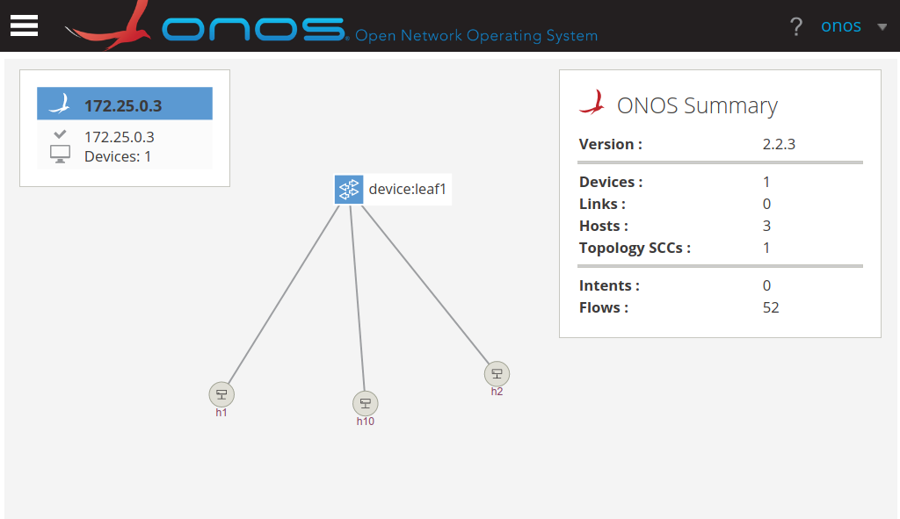
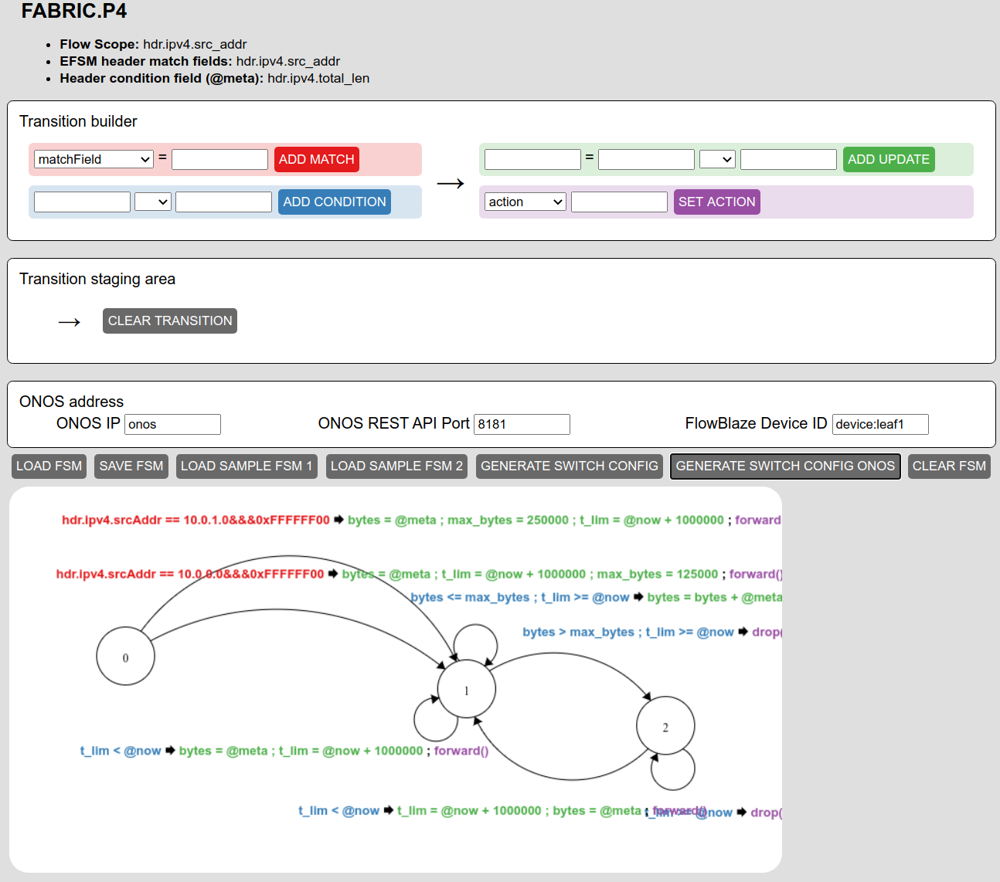

# Multi-Class Rate Limiter
This use case implements a two-class rate limiter. The class of traffic is
identified by the IP source subnet. The host parts of the two subnsts
will have 2 different allowed rates.

## Guide

Start the Docker-compose network. This includes Mininet, ONOS and the EFSM GUI:
```
make start
```
ONOS GUI and EFSM GUI will be available at the following links:
- ONOS GUI: [http://localhost:8181/onos/ui](http://localhost:8181/onos/ui) 
(USER:onos, PASSWORD: rocks)
- EFSM GUI: [http://localhost:8000](http://localhost:8000)

When ONOS is correctly started (it can take up to 2 minutes), run the following
make target to push the FlowBlaze ONOS app and the network configuration:
```
make setup
```
We can also do a pingall, in this way ONOS will discover all the hosts in the
Mininet topology.
```
make pingall
```
After that, the switch and hosts should appear in the ONOS GUI:


Now we can draw the EFSM in the EFSM GUI:


Or otherwise loading the [`EFSM_rate_limiter.json`](EFSM_rate_limiter.json)
using the LOAD FSM button.

When the EFSM is drawn we can push the runtime configuration to ONOS using the 
GENERATE SWITCH CONFIG ONOS button.

Now, we can run:
```
make h1-test
```
and obtain a similar output:
```

```
and
```
make h2-test
```
and obtain a similar output:
```

```
The 2 hosts, being part of two different subnets have different associated rates.

## Useful make Targets
[Documentation](../../docs/useful_make_targets.md)


## Teardown
```bash
make stop
```

