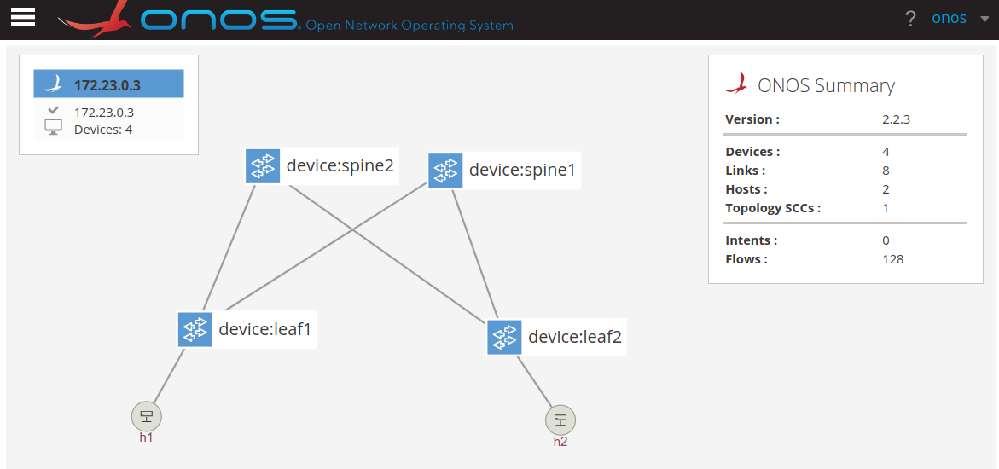
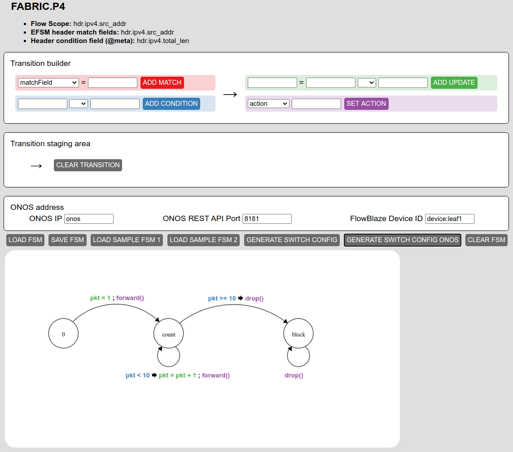

# Packet Limiter
This use case implements a packet limiter that drops all the traffic from a host
after 10 packets.

## Guide

Start the Docker-compose network. This includes Mininet, ONOS and the EFSM GUI:
```
make start
```
ONOS GUI and EFSM GUI will be available at the following links:
- ONOS GUI: [http://localhost:8181/onos/ui](http://localhost:8181/onos/ui) 
(USER:onos, PASSWORD: rocks)
- EFSM GUI: [http://localhost:8000](http://localhost:8000)

When ONOS is correctly started (it can take up to 2 minutes), run the following
make target to push the FlowBlaze ONOS app and the network configuration:
```
make setup
```

After that, the switch and hosts should appear in the ONOS GUI:


Now we can draw the EFSM in the EFSM GUI:


Or otherwise loading the [`EFSM_packet_limiter.json`](EFSM_packet_limiter.json)
using the LOAD FSM button.

When the EFSM is drawn we can push the runtime configuration to ONOS using the 
GENERATE SWITCH CONFIG ONOS button.

Now, we can run:
```
make test-ping
```
The ping should fail after 10 successful pings.

## [Useful make Targets](../../docs/useful_make_targets.md)


